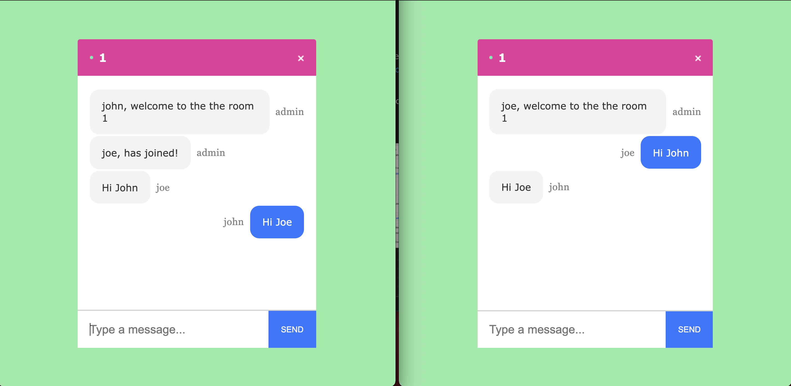

# Chat-App

A real-time Chat-app using Netlify, Socket.io, React and Express.

## Table of Contents

- [Description](#description)
- [Installation](#installation)
- [Technologies Used](#technologies)
- [Links](#link)
- [License](#License)

## Description:

An app that allows users to enter create and join live chat rooms. To get started, enter your name and the chat room you wish to join. Can support upto 25 chats.

## Installation:

In the command line of the working directory, install the following NPM packages: axios, express, mongoose, react, react-bootstrap, react-dom, react-strip, uuid.

## Technologies

- [Netlify](https://www.netlify.com/)
- [React.js](https://reactjs.org/)
- [Socket.io](https://socket.io/)
- [Express](https://expressjs.com/)
- [Node.js](https://nodejs.org/en/)
- [Redis](https://redis.io/)
- [Javascript](https://www.javascript.com/)
- [HTML](https://developer.mozilla.org/en-US/docs/Web/HTML)
- [CSS](https://developer.mozilla.org/en-US/docs/Web/CSS)

## Links

Click here for the [Link](https://jovial-dijkstra-0de28b.netlify.app)

Click here for [GitHub](https://github.com/10-kp/chat-socket)

## License:

MIT
